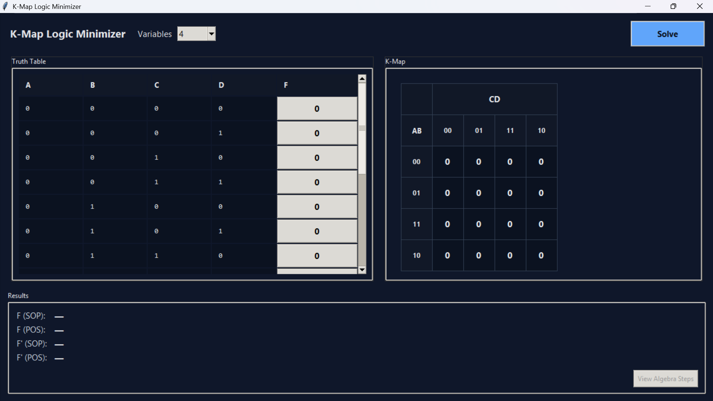
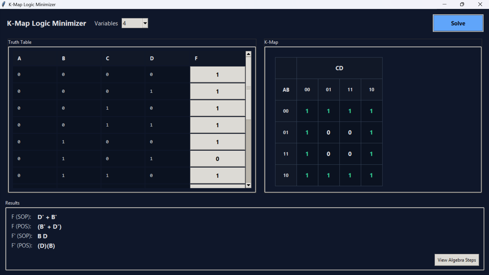
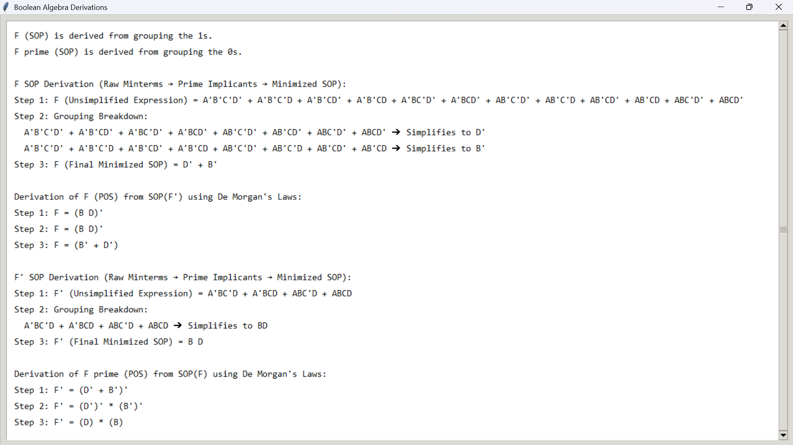

# K-Map Logic Minimizer

A high-performance EDA tool built in Python that simplifies Boolean expressions using the **Quine–McCluskey algorithm** (tabular method).

## Key Features

- **Two-way binding (real-time sync)** between the Truth Table and the Karnaugh Map (K-Map)
- **2–4 variables** supported (common K-Map sizes)
- **Don't Care (`X`) handling** to allow larger groupings and better simplification
- **Minimized expressions** generation for:
  - **F (SOP)** and **F (POS)**
  - **F′ (SOP)** and **F′ (POS)**
- **Step-by-step algebra derivations UI** (Prime Implicants → minimized SOP, then De Morgan POS conversion)

## How to Run

### Prerequisites

- **Python 3.10+** recommended (Tkinter included with most standard Python installs)

### Run (Windows / PowerShell)

From the project folder:

```bash
python main_ui.py
```

> Note: This project currently uses only Python standard library modules (plus Tkinter).  


## Screenshots

**Main UI (Truth Table + K-Map)**


**Results (SOP/POS for F and F′)**


**Boolean Algebra Derivations window**


## Project Structure

- `main_ui.py`: Main Tkinter application (Truth Table, K-Map UI, results, derivations window)
- `qm_algorithm.py`: Quine–McCluskey solver + SOP/POS helpers + derivation generators
- `kmap_visuals.py`: K-Map rendering and interaction layer
